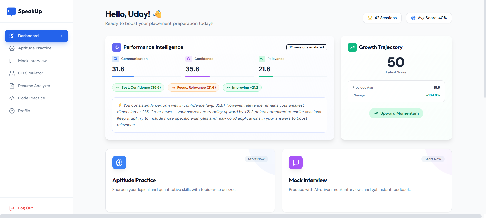
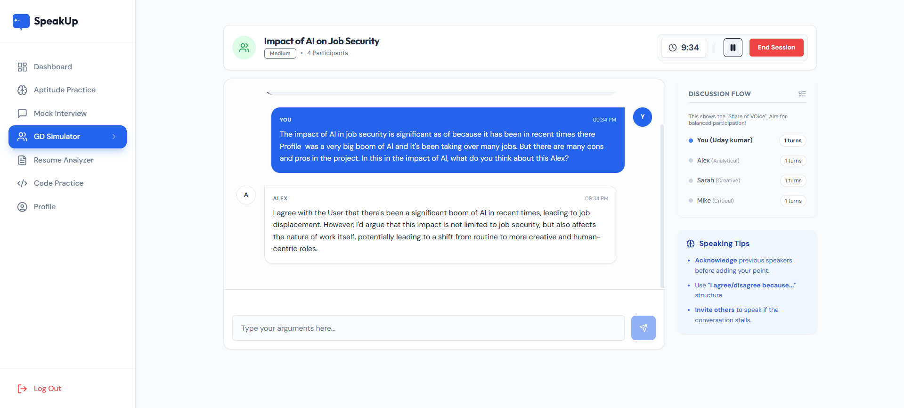
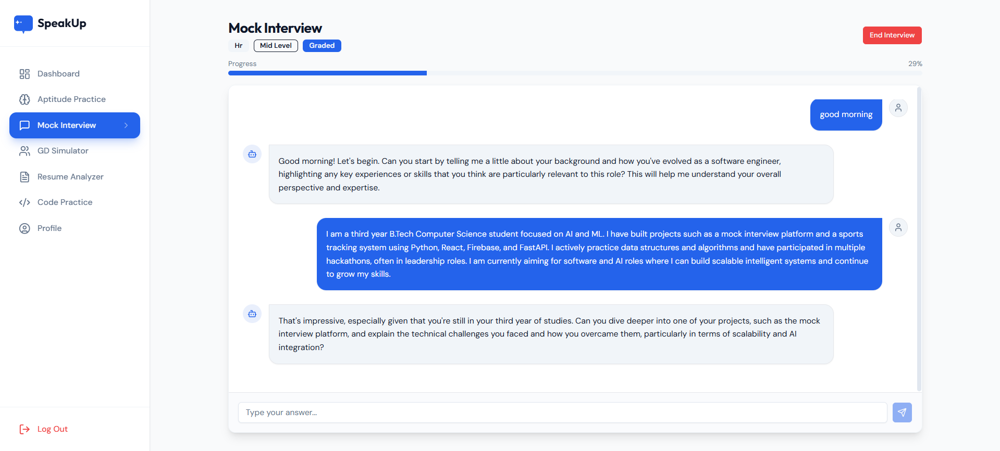
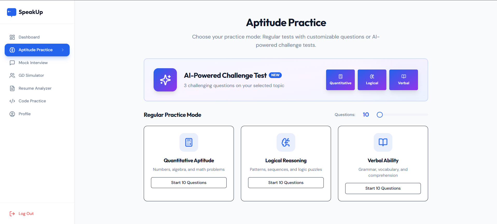
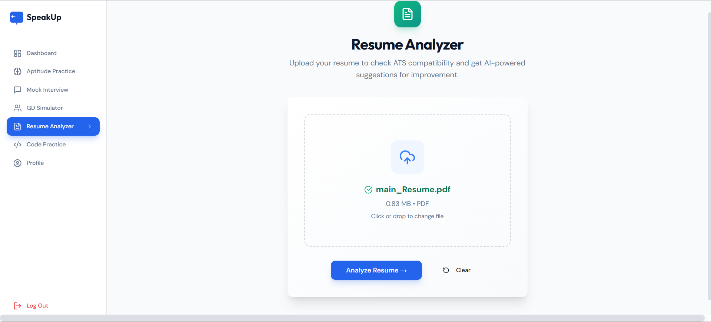
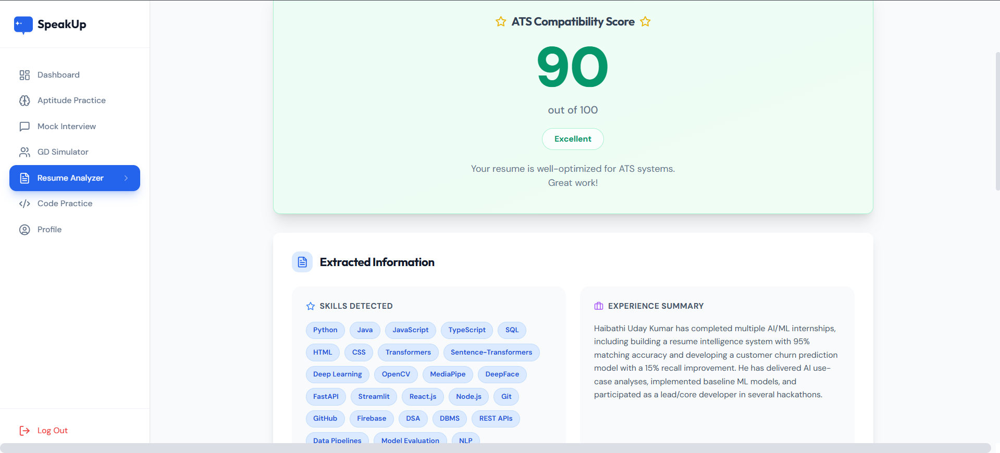

# SpeakUp — AI-Powered Placement Prep Platform

[](https://speakup-d3593.web.app/)

AI-driven placement preparation platform with mock interviews, aptitude tests, group discussions, resume analysis, and coding practice.

---

## 🏆 Hackathon Submissions

| Hackathon | Achievement | Milestone |
|-----------|-------------|-----------|
| **AI for Bharat** | ✅ Shortlisted | Advanced to Prototype Round |

---

## ✨ Features

| Module | Description |
|--------|-------------|
| **📊 Dashboard** | Personalized greeting, progress stats, recent activity timeline |
| **🧠 Aptitude** | Quantitative, Logical, Verbal — with AI Challenge Mode (3 hard questions) |
| **💼 Mock Interview** | HR/Technical, Graded/Practice modes, adaptive follow-ups, "Teach Me" feature |
| **🗣️ GD Simulator** | AI bots with personalities, 6-metric scoring, share-of-voice tracking |
| **📄 Resume Analyzer** | ATS score (0-100), keyword extraction, actionable suggestions |
| **💻 Coding Practice** | LeetCode-style environment, Judge0 execution, Python/Java/C++ |

---

## 📸 App Preview & Screenshots

### 📊 Dashboard & Analytics


### 🗣️ Group Discussion (GD) Simulator


### 💼 Adaptive Mock Interview


### 🧠 Aptitude Practice & AI Challenge Mode


### 📄 Resume Upload & ATS Analysis Result
| Uploading Resume | ATS Analysis Result |
| :---: | :---: |
|  |  |

---

## 🛠️ Tech Stack

| Layer | Technologies |
|-------|--------------|
| **Frontend** | React + TypeScript, Vite, Tailwind CSS, Shadcn UI, Framer Motion, Wouter |
| **Backend** | FastAPI (Python), Uvicorn |
| **AI** | Groq — Llama-3.3-70b (primary), Llama-3.1-8b (fast tasks) |
| **PDF** | Google Document AI + pdfplumber fallback |
| **Code Exec** | Judge0 CE |
| **Auth & DB** | Firebase Authentication + Cloud Firestore |

---

## 🚀 Getting Started

**Prerequisites:** Node.js 16+, Python 3.9+

```bash
# 1. Clone repo
git clone https://github.com/P-Jaswanth-Reddy/Speakup.git
cd Speakup

# 2. Frontend
cd frontend && npm install && npm run dev

# 3. Backend (new terminal)
cd backend
python -m venv venv
venv\Scripts\activate  # Windows
pip install -r requirements.txt
uvicorn main:app --reload
```

App runs at `http://localhost:5173`

---

## 📁 Project Structure

```
speakup/
├── backend/           # FastAPI + Groq AI
│   ├── services/      # interview, gd, aptitude, resume, coding
│   └── data/          # JSON question banks
├── frontend/          # Vite + React app
│   └── client/src/
│       ├── pages/     # Dashboard, Interview, GD, Resume, Coding, Aptitude
│       └── components/# Shadcn + custom UI
└── docs/              # Documentation
```

---

## 👥 Contributors & Creators

* **H. UdayKumar** — Project Creator, Lead Developer & Project Manager
  * **Role**: Platform architect and lead system integrator.
  * **GitHub**: [udaykumar0515](https://github.com/udaykumar0515)
  * **Email**: [udaykumarhaibathi@gmail.com](mailto:udaykumarhaibathi@gmail.com)

* **P. Jaswanth Reddy** — Core Developer & Contributor
  * **Contributions**: Designed and developed the **Aptitude Practice** module (including AI Challenge Mode) and the **GD Simulator** (featuring the orchestrator-monitor bot architecture).
  * **GitHub**: [P-Jaswanth-Reddy](https://github.com/P-Jaswanth-Reddy)
  * **Email**: [pjaswanthreddy5949@gmail.com](mailto:pjaswanthreddy5949@gmail.com)


